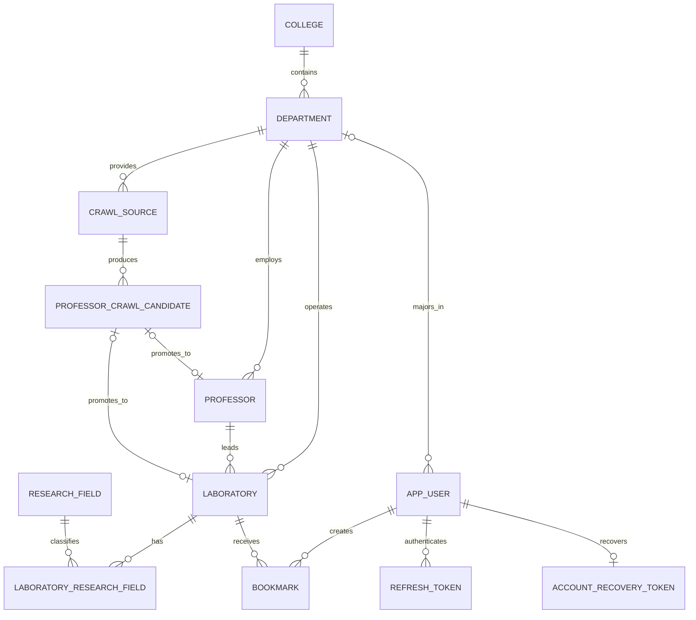

# 연구실 검색 서비스 ERD

- 연구실은 책임 교수 및 학과를 각각 하나씩 반드시 가진다.
- 연구 분야는 0개 이상이며 연결 테이블의 복합 기본키로 중복을 막는다.
- 연구실은 `deleted_at`으로 소프트 삭제한다.
- 활성 연구실의 이름은 학과 내에서 중복될 수 없다. `active_name`을 생성 컬럼으로 관리하고 `(department_id, active_name)` 유니크 제약을 적용한다.
- 소프트 삭제된 연구실의 `active_name`은 `NULL`이므로 같은 학과에서 이름을 재사용할 수 있고 삭제 이력도 보존된다.
- 모집 상태는 `RECRUITING`, `ALWAYS_OPEN`, `CLOSED`, `UNKNOWN`만 저장할 수 있다.
- 크롤링 출처 URL은 `crawl_source`에서 학과와 파서 유형별로 관리하고 URL 중복을 허용하지 않는다.
- 수집한 교수 정보는 `professor_crawl_candidate`에 `PENDING`으로 저장하며, 검수 후 확정된 데이터만 본 테이블에 반영한다.
- 후보의 학과는 연결된 `crawl_source`를 통해서만 결정하여 출처와 학과가 어긋나는 상태를 만들지 않는다.
- 후보에는 수집 당시 URL과 파서 유형을 스냅샷으로 남겨, 출처 설정이 바뀌어도 과거 데이터의 실제 출처를 추적할 수 있다.
- 재크롤링에서 더 이상 발견되지 않은 후보는 삭제하지 않고 `is_stale = true`로 분리하여 검수 이력을 보존한다.
- 후보의 우선 식별키는 이메일, 홈페이지, 정규화한 이름 순서로 만든다. 재크롤링에서는 이메일·홈페이지·고유한 이름을 별칭으로 비교해 연락처가 일시 누락되어도 기존 후보를 이어 간다.
- `(source_id, source_identity_key)` 유니크 제약으로 원본 사이트의 완전 중복은 합치되, 같은 이름이고 이메일 또는 홈페이지가 다른 실제 동명이인은 각각 보존한다. 안정적인 식별 정보가 전혀 없는 동명이인은 자동 병합하지 않고 충돌로 처리한다.
- 크롤링과 검수가 동시에 같은 행을 수정하면 조용히 덮어쓰지 않도록 출처와 후보에 낙관적 잠금 버전을 둔다.
- 연구실 분류용 `department`와 세종대 인증 응답의 소속은 용도가 다르다. 연계전공·계열·칼리지까지 연구실 학과에 섞지 않는다.
- 세종대 인증 소속은 `app_user.sejong_department_name`에 로그인 시점 스냅샷으로 저장하고 재로그인 시 학교 응답명으로 갱신한다.
- 기존 `major_department_id`는 연구실 도메인의 학과 선택이 필요한 프로필을 위해 유지하며 세종대 인증 소속을 이름만으로 자동 연결하지 않는다.
- `profile_completed`는 학교가 제공한 이름·학과가 반영됐거나 수동 프로필의 이름·학년·전공이 입력됐는지를 나타낸다. 학교 프로필의 nullable 학년은 완료 판정이나 기능 접근 조건으로 사용하지 않는다.
- 승인된 현재 후보만 교수와 연구실로 승격한다. 후보에는 승격된 본 테이블 ID, 승격 시각, 승격에 사용한 검수 시각을 기록하여 재실행 중복을 막는다.
- 공식 연구실 이름은 `name_source = OFFICIAL`, 이름이 없어 `교수명 + 교수님 연구실`로 만든 값은 `name_source = GENERATED`로 구분한다.
- 후보 승격은 후보와 학과 행을 잠근 뒤 교수·연구실·승격 이력을 한 트랜잭션으로 저장한다. 재검수한 새 승인본만 기존 연결 데이터를 갱신하며 모집 상태 같은 수기 관리 값은 보존한다.
- 사용자의 이름, 학년, 전공, GPA 구간, 자기소개는 `app_user`에서 관리한다. 로그인 직후 프로필이 미완성일 수 있으므로 필수 입력값도 DB에서는 `NULL`을 허용한다.
- 사용자의 전공은 `major_department_id`로 기존 학과를 참조하며 단과대 컬럼을 중복 저장하지 않는다.
- GPA 구간은 `GTE_3_0`, `GTE_3_5`, `GTE_4_0`만 허용하고, 미선택 상태는 `NULL`로 표현한다.
- 자기소개는 최대 500자이며 승인된 내용과 검수 시각·정책·제공자 버전을 같은 트랜잭션에서 저장한다.
- 회원 탈퇴 상태는 `app_user.deleted_at`으로 기록하고, 30일 경과 익명화 완료 시각은 `anonymized_at`으로 기록한다. `auth_version`은 탈퇴할 때 증가하며 Access JWT의 발급 버전과 비교해 탈퇴 전 토큰이 복구 후 되살아나는 것을 막는다.
- `refresh_token`은 토큰 해시, 미사용 만료 시각, 폐기 시각을 저장한다. `session_id`는 같은 로그인에서 회전한 토큰을 묶고, `absolute_expires_at`은 최초 로그인부터 30일로 고정한다. 별도 서버 세션 테이블은 사용하지 않는다.
- Refresh는 미사용 14일과 절대 30일 중 먼저 도래하는 시각에 만료된다. 명시적 로그아웃은 현재 로그인 묶음을 폐기하고, 회원 탈퇴는 사용자의 모든 Refresh 행을 즉시 물리 삭제한다.
- `account_recovery_token`은 사용자마다 최대 하나인 일회용 복구 토큰의 SHA-256 해시와 만료 시각만 저장한다. 탈퇴·복구·익명화 시 물리 삭제한다. 상세 정책은 [회원 탈퇴 및 계정 복구 계약](account-withdrawal-recovery.md)을 참고한다.
- `bookmarkCount`는 저장하지 않고 `bookmark`를 집계하며, `(laboratory_id)` 보조 인덱스를 사용한다.
- 마이페이지의 최신 북마크 조회는 `(user_id, created_at DESC, laboratory_id DESC)` 인덱스를 사용한다.
- 단과대·학과·교수 참조 삭제는 제한하고, 연구실 물리 삭제 시 연결 데이터와 북마크는 연쇄 삭제한다.
